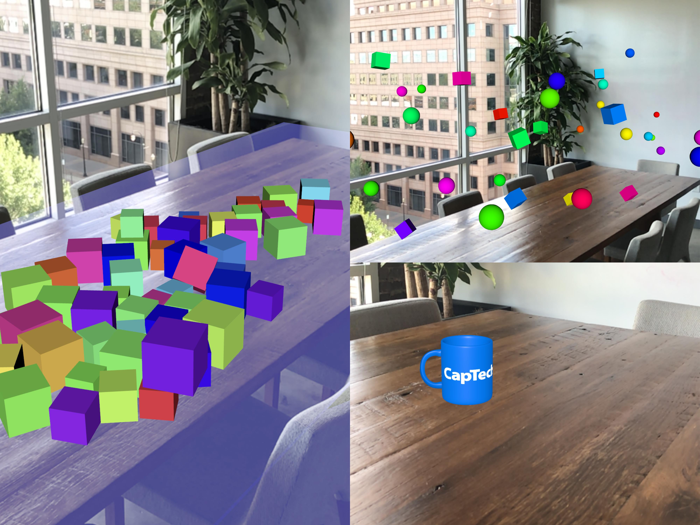

# arkit-demo
> A sample application that demos the fundamentals of ARKit development for iOS 11. 

[![Swift Version][swift-image]][swift-url]

</img>

This source code is provided as part of an online tutorial: [ARKit Fundamentals in iOS 11](https://www.captechconsulting.com/blogs/arkit-fundamentals-in-ios-11)

## Features

- Anchor spheres & cubes to the world by tapping the screen
- Drop boxes onto real-world planes with simulated physics
- Tap a real-world plane to place a coffee mug

## Requirements

- iOS 11+
- Xcode 9+

[swift-image]:https://img.shields.io/badge/swift-4.0-orange.svg
[swift-url]: https://swift.org/